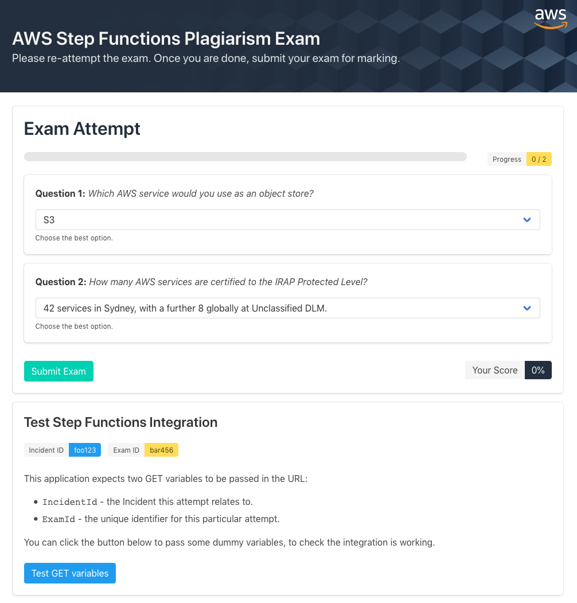

# AWS Step Functions Plagiarism Demo - Test Centre

An app designed to test students as part of an AWS Step Functions workflow.

It can accept GET variables to refer to an exam attempt: IncidentId, ExamId,
Test Centre.



## Test Centre role in Plagiarism Step Functions workflow

The flow for use of the Test Centre is:

- A Step Functions execution is initiated.
- An exam attempt is generated.
- A mail is sent to the student, with a link in the following format:

`GET https://testcentre.example.com/?ExamID=foo&IncidentId=bar&TaskToken=baz`

- A student then completes a test. Once done, a request is sent back to Step Functions as a POST request, to an API Gateway endpoint, with their score and the task token:

`POST https://1234567890-abcdefgh.amazonaws.com/submitExam`

**Payload**
```
{
  "ExamId": "foo",
  "IncidentId": "bar",
  "TaskToken": "baz",
  "Score": "69"
}
```

# Deploying

1. This project is designed to deploy via the Amplify Console.

2. It assumes you have already deployed the parent `AWSStepFunctionsPlagiarismDemo.`

3. Get the API Gateway endpoint after it is deployed:

`aws cloudformation describe-stacks --stack-name aws-step-functions-plagiarism-demo --query 'Stacks[].Outputs' | grep api`

4. Then, create a new Amplify Console project.

5. Connect it to a repository hosting this code, then set an enviromnet variable called `NEXT_PUBLIC_API_ENDPOINT` in the .env file with the value that you just got from the CloudFormation output.

6. Deploy the site.

## Project setup
### Install dependencies

```
pnpm install
```

### Compile and hot-reloads for development
```
pnpm dev
```

### Compile and minify for production
```
pnpm build
```
### Lint and fix files
```
pnpm run lint
```

